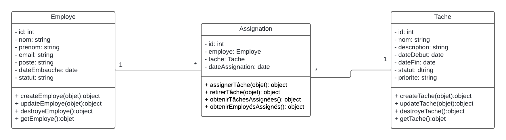

# Gestion de Projet 

Ce projet implémente un système de gestion de projet en express pour la gestion des employés, des tâches et des assignations. Le système permet de créer, lire, mettre à jour et supprimer des employés et des tâches, ainsi que d'assigner des tâches aux employés et de gérer ces assignations.

## Fonctionnalités

- **Gestion des Employés**
  - Créer, lire, mettre à jour et supprimer des employés.
  - Attributs : `id`, `nom`, `prenom`, `email`, `poste`, `dateEmbauche`, `statut`.

- **Gestion des Tâches**
  - Créer, lire, mettre à jour et supprimer des tâches.
  - Attributs : `id`, `nom`, `description`, `dateDebut`, `dateFin`, `statut`, `priorite`.

- **Gestion des Assignations**
  - Assigner des tâches à des employés et retirer ces assignations.
  - Obtenir la liste des tâches assignées à un employé.
  - Obtenir la liste des employés assignés à une tâche.
  - Attributs : `employe`, `tache`, `dateAssignation`.

## Installation
- initialisé le projet: `npm init`
- express : `npm i express`
- bodyParser: `npm i body-parser`
- nodemon: `npm i nodemon`
- Clonez ce dépôt :

    ```bash
        git clone https://github.com/Ousmanly/gestion-projet-express.git
    ```

## Utilisation

-  Accédez au répertoire du projet :

    ```bash
        cd composant-metier
    ```
- Lancer le projet : `npm start`
## UML

## Author
- **GitHub** : [Ousmane Ly](https://github.com/Ousmanly)
- **LinkedIn** : [Ousmane Ly](www.linkedin.com/in/ousmane-ibrahima-ly-a270a4290)